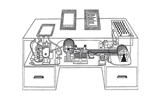
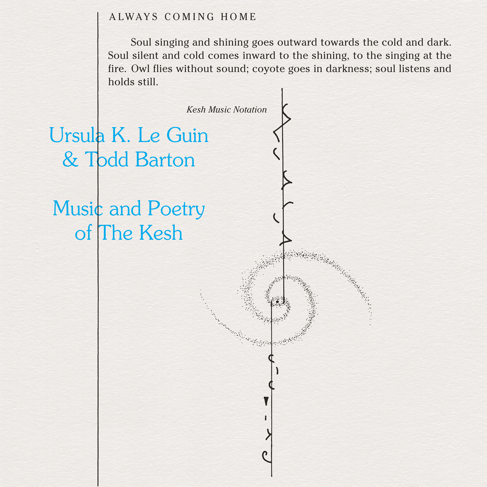
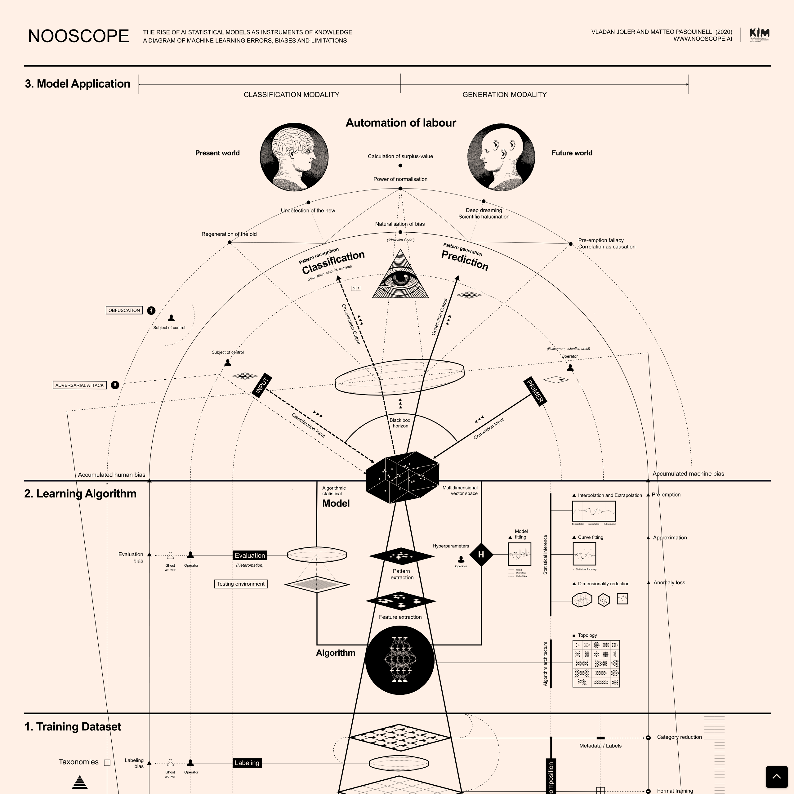

# NLP projects
## AI Specialization Course - FIUBA (Universidad de Buenos Aires)

### 1) Word2vect with Numpy
- OneHot encoding
- Frequency vectors
- TF-IDF
- Document comparation -  cosine similarity

### 2) Bot with NLTK

Bot made with the "Memex" definition on wikipedia. 
The memex was a device imagine by Vannevar Bush that was supposed to keep many documents for consulting them. It is the same idea of this bot: To have a big amount of documents avaible for consulting them by looking for words. 

### 3) Custom embeddings with Gensim 

Training embeddings for a corpus of Ursula K. Le Guin's poems. 

By training embeddings and depicting them in a 2d space it is possible to get information about the relationship that exists among words in the Ursula's poems. 

### 4) Next word prediction

The goal is to use documents/corpus to create word embeddings based on that context using the Keras Embedding layer. Those embeddings will be secured along with the LSTM layers to predict the next possible word.

The corpus is an Essay "THe Nooscope" that talks about AI an its implications.

### 5) Sentiment analysis with embeddings + LSTM

The objective is to use the reviews of clothing buyers so that the system determines the evaluation of the buyer and his criticism (how many stars he assigns to the product).

### 6) Seq2seq bot QA

The object is to use data available  of conversations in English. A BOT will be built to answer user questions (QA).

Contact: _apguzmanc@gmail.com_
